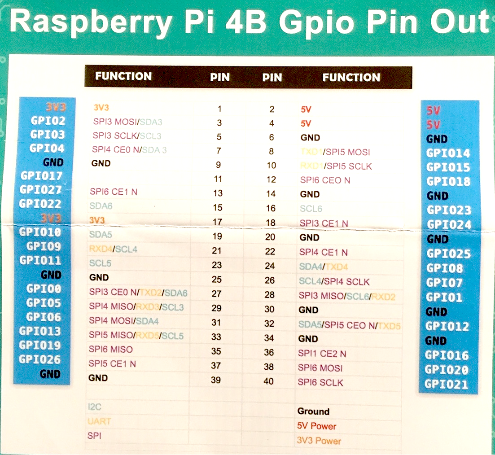

# Introduction to Raspberry PI (rPI) & LED Circuits

### [Reference document for First Steps in Learning about Raspberry PI](Bush_RPI_PYTHON_ROBOTICS.pdf)

### Step 1. Get to know and then Access Your Assigned Team Raspberry PI

1. Let's examine your rPI host and get to know it. It has to be handled delicately at all times!. We will now power it up and wait for 2 minutes. We can then make sure it shows up on the Bush network!

    

1. [Click here to Verify access to Your Team Raspberry PI  (replace bupiX with your assigned  rPI hostname in the address bar of your browser)](http://bupiX.bush.edu)

    🟠 ✅ Do you see Confetti ??
     
1. [Click here to Access Your Team Raspberry PI's JupyterLab (replace bupiX with your rPI hostname in the address bar of your browser)](http://bupiX.bush.edu:8081)
 
    🟠 ✅ Do you see the JupyterLab hosted on your Raspberry PI ??
    

1. Download the ```sysinfo.ipynb``` by [right-clicking this link and select 'Save Link As'](sysinfo.ipynb) and then drag the file to your PI's JupyterLab. Run the sysinfo Jupyter Notebook and document your results in a ```dated``` page of your workshop notebook.

    🟠 ✅ Did you write down the your RPI's sysinfo results in a ```dated``` 


1. We will use the Multimeter to measure some voltages from the pins. See the pin layout of your Raspberry PI Host below. Place the ```Black probe``` of your Multimeter on any ```GND ground``` pin of your rPI and the ```Red probe``` on the ```3V3 or 5V pin``` of your rPI. Write down the voltage you measure from the 3.3 volt pin and the 5 volt pin on your Raspberry PI on the previously ```dated``` page of your Workshop Notebook. 


    
    

    | 🟠 ✅   Did you write voltages down on the ```dated``` page of your Workshop Notebook ??  |
    |-----------------------------------------|
    
### Step 2. Let's create our first Raspberry PI Jupyter Notebook in JupyterLab

1. Download the ```first_notebook.ipynb``` by [right-clicking this link and select 'Save Link As'](first_notebook.ipynb) and then drag the ```first_notebook.ipynb``` file to your laptop to the rPI's JupyterLab.  

1. Create a hand-drawn wiring diagram for the following circuit imaged below. Modify the template of the wiring diagram given to you to create this drawing. Take a picture of the wiring diagram and mail it to yourself. Add this picture file (.jpg or .png) from your laptop to your laptop to the rPI's JupyterLab.  Add a link to this picture inside the Wiring diagram Markdown cell created for you by adding a single line similar to:
    ````
    
    ````
1. Wire-up your RPI following your own hand-drawn diagram. Note LED +lead should be connected to GPIO4. The other (-ve) lead of the LED can be directly connected to the ground via the -ve rail of the breadboard.

    
    

1. Now you are ready to Run the Jupyter Notebook ```first_notebook.ipynb```. Your notebook should like the image below. Click the red-circled button to Run your notebook.

    


    🟠 ✅  Did you create, and upload your wiring diagram and verify the corresponding code in the Jupyter Notebook ??  If not, please do this as it is part of your assessment!
    
    🟠 ✅  Do you see your LED blinking? If not, please debug with your partner by looking at the wiring diagram, and code.  If this fails, call me or the 

### Step 3. LED circuit
1. Change sleep time to see if it works
1. Change LED to GPIO port to 18. The other (-ve) lead of the LED can be directly connected to the ground via the -ve rail of the breadboard. Change the code correspondingly and and run to see if it works again!

    🟠 ✅  This is practice only - you do not need to draw a wiring disgram diagram for this. Does it work ?  If not, please debug with your partner or call me or the TA to assist you 

### Step 4. Button control - Adding a Button to the circuit

1. Download the ```button_test.ipynb``` by [right-clicking this link and select 'Save Link As'](button_test.ipynb) and then drag the ```button_test.ipynb``` file to your laptop to the rPI's JupyterLab.  

1. Create a hand-drawn wiring diagram for the following circuit imaged below. Modify the template of the wiring diagram given to you to create this drawing. In this circuit we are changing the LED to GPIO port back to GPIO4. Show the button or LED in your drawing further down the breadboard so as not to interfere with the led previously installed.  Note LED +lead should be connected to GPIO4. The other (-ve) lead of the LED can be directly connected to the ground via the -ve rail of the breadboard. Show the button connected to GPIO17 and the other to the ground rail.  

    
    

    🟠 ✅ Note your drawing should now contain both the LED and the Button!
    

1. Take a picture of the wiring diagram and mail it to yourself. Add this picture file (.jpg or .png) from your laptop to your laptop to the rPI's JupyterLab.  Add a link to this picture inside the Wiring diagram Markdown cell created for you by adding a single line similar to:

    ````
    
    ````

1. Wire-up your RPI following your own hand-drawn diagram above. Ensure that the code in ```button_test.ipynb``` ***LED setup*** block and the ***Button setup*** block correctly reflects the GPIO pins you used for the LED and Button.

1. Note that we have added a callback function for the button called ```pressed``` in the ```BUTTON setup ``` block. We will walkthrough this code together.  The ```MAIN loop``` block remains the same as before, although the LED is blinking faster!

1. Run the ```button_test.ipynb``` notebook.  Your notebook should like the image below. Click the restart & runall button as before to Run your notebook.
    
1. Now you will see that both the LED and Button are functional, except they are NOT linked to each other.  This will be the purpose of the next step.


    🟠 ✅ Did you make a new wiring diagram and make changes to the Jupyter Notebook ??  If not, please do this as it is part of your assessment!
    
    🟠 ✅ Does it work ?  If not, please debug with your partner by looking at the wiring diagram, and code.  If this fails, call me or the TA to assist you


### Step 5. Control LED via Button

1. To create this notebook we will combine the Button capability to turn on or turn off the LED. This means that the button needs to behave like a toggle switch. 

1. There are NO wiring changes needed. You can use the same wiring diagram and breadboard setup as before.

1. Download the ```toggle_led.ipynb``` by [right-clicking this link and select 'Save Link As'](toggle_led.ipynb) and then drag the ```toggle_led.ipynb``` file to your laptop to the rPI's JupyterLab.

1. Open the ```toggle_led.ipynb``` by double-clicking on it in JupyterLab. Your challenge is to modify inside the ```MAIN loop``` block underneath the ```While True:``` and add to make it work.

    ````
    if button_state:
        # some code ..
    else:
        # some code ..
    ````
1. Run the ```toggle_led.ipynb```

    🟠 ✅ Does it work ?  If not, please debug with your partner by looking at the wiring diagram, and code.  If this fails, call me or the TA to assist you


### Step 6. Finally let us create a Button Reaction Game!

1. To create this game, we will download the ```reaction_game.ipynb``` by [right-clicking this link and select 'Save Link As'](reaction_game.ipynb) and then drag the ```reaction_game.ipynb``` file to your laptop to the rPI's JupyterLab.

1. You will need to add a second button as shown in the code you brought in. Create a wiring diagram based on the code that you see.

1. Create a wiring diagram including you second button.  In this diagram, there needs to be 1 LED and 2 Buttons wired up. Take a picture of the wiring diagram and mail it to yourself. Add this picture file (.jpg or .png) from your laptop to your laptop to the rPI's JupyterLab.  Add a link to this picture inside the Wiring diagram Markdown cell created for you by adding a single line similar to:

    ````
    
    ````

    🟠 ✅ Did you make a new wiring diagram and make changes to the Jupyter Notebook ??  If not, please do this as it is part of your assessment!

1. Add the second Button to your Breadboard. Once circuit is wired according to the code, two of you can play this game to see who has the fastest finger in the West! Seek help if you cannot get it to work.

    🟠 ✅ Did the game work ?  If not, please debug with your partner by looking at the wiring diagram, and code.  If this fails, call me or the TA to assist you

    🟠 ✅ Modify the game to code to handle an EVEN number of rounds (Game could be tied in this case and there should be no winners).  
    
    🟠 ✅ Did your modifications work ?  The game should still work if there is an even number of rounds and should declare a Tie and no winners.
