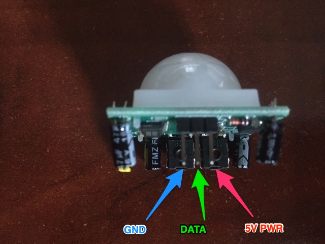
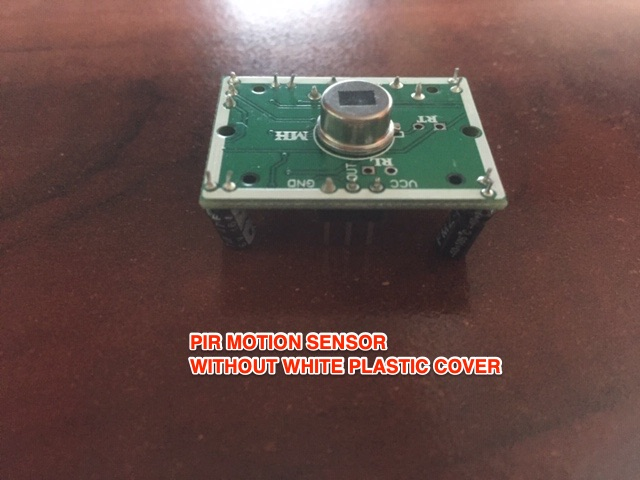
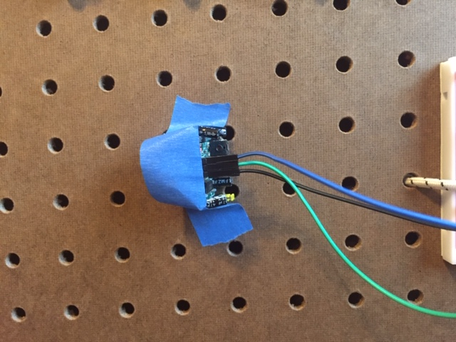

# A deeper dive into Python with Neopixels, Camera, Buttons and Motion Sensors
1. [Learn Python Step by Step using Button Actions and Neopixels](https://chandrunarayan.github.io/fcsr/projects/python_deep_dive/python_step_by_step.ipynb)
1. [Learn Python Step by Step using Camera and Motion Sensing](https://chandrunarayan.github.io/fcsr/projects/python_deep_dive/python_step_by_step2.ipynb)
    1. Use the images below when connecting the Motion (PIR) Sensor 
  
   
   
   
