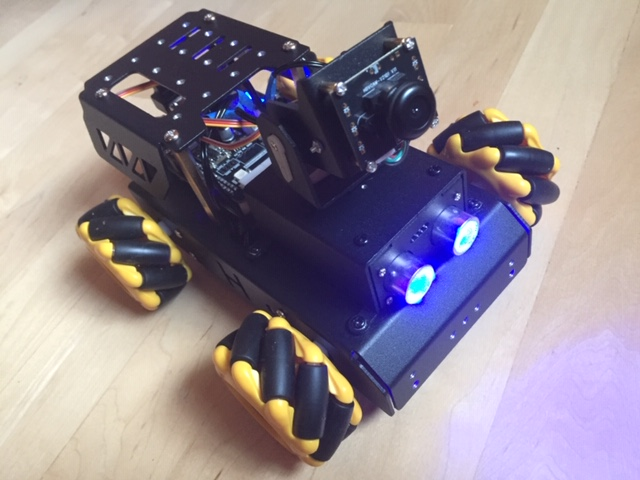

# Bush PI Robot Car - SnooPi -  get it?

### A.  First build SnooPi following the instructions below

1. [Lesson 1 Introduction to SnooPi](Lesson1_Intro_SnooPi.pdf)
1. [Lesson 2 Intro to Mecanum Wheels](Lesson2_Intro_Mecanum_Wheels.pdf)
1. [Lesson 3 Build SnooPi](Lesson3_Build_TurboPI.pdf)

### B.  Access SnoPi using Jupyter Notebooks and Test your build.

As before, clicking them will download to your laptop.  Drag these files one at a time to your Jupyter Lab and run them by Shift-Clicking each cell from the top to ensure proper functioning.  If there is an error - stop and do not proceed until you have been able to fix it.   It will help to Shutdown All Kernels first before attempting to run the notebook.

First put the car on a small pedestal such that the car does not actually move (wheels should not touch the floor) before trying these notebooks below.  

1. [Activate SnooPi's Buzzer and Lights](assignments/student_rcBuzzerLEDTest.ipynb)
2. Make SnooPi Go
    - [Run Forward](assignments/student_rcForward.ipynb)
    - [Run Diagonal](assignments/student_rcSlant.ipynb)
    - [Spin in Place](assignments/student_rcSpin.ipynb)
    - [Drift in circles](assignments/student_rcSpin.ipynb)
    - [SnooPi can measure Distance using Sonar](assignments/student_rcSonar.ipynb)
    - [Move SnooPi's Head](assignments/student_rcServos.ipynb)
3. [SnooPi takes a picture](assignments/student_rcCamera.ipynb)
4. After the tests above are successful, you will do individual assignments per table below

### C. SnooPi Individual Assignments Table

Notebook#|Student|Description|SnooPi Notebook Starter|Status
:---|:---|:---|:---|:---|
0|***Team Dagi***|Checkout & Verify SnooPi|[student_rcHardware.ipynb](http://bushastrolab.com/hub/user-redirect/git-pull?repo=https%3A%2F%2Fgithub.com%2Fchandrunarayan%2Ffcsr&branch=gh-pages&urlpath=lab%2Ftree%2Ffcsr%2Fprojects%2Frpi_car%2Fassignments%2Fstudent_rcHardware.ipynb)|🤖 IN-WORK
1|Dagi|Buzzer Patterns|[student_rcBuzzerLEDTest.ipynb](http://bushastrolab.com/hub/user-redirect/git-pull?repo=https%3A%2F%2Fgithub.com%2Fchandrunarayan%2Ffcsr&branch=gh-pages&urlpath=lab%2Ftree%2Ffcsr%2Fprojects%2Frpi_car%2Fassignments%2Fstudent_rcBuzzerLEDTest.ipynb)|🤖 IN-WORK
2|Kai|Sonar Distance|[student_rcSonar.ipynb](http://bushastrolab.com/hub/user-redirect/git-pull?repo=https%3A%2F%2Fgithub.com%2Fchandrunarayan%2Ffcsr&branch=gh-pages&urlpath=lab%2Ftree%2Ffcsr%2Fprojects%2Frpi_car%2Fassignments%2Fstudent_rcSonar.ipynb)|🤖 IN-WORK
3|Bing|Turn & Snap Picture|[student_rcTurn.ipynb](http://bushastrolab.com/hub/user-redirect/git-pull?repo=https%3A%2F%2Fgithub.com%2Fchandrunarayan%2Ffcsr&branch=gh-pages&urlpath=lab%2Ftree%2Ffcsr%2Fprojects%2Frpi_car%2Fassignments%2Fstudent_rcTurn.ipynb)|🤖 IN-WORK
4|Gus|Swivel head & Snap Picture|[student_rcServos.ipynb](http://bushastrolab.com/hub/user-redirect/git-pull?repo=https%3A%2F%2Fgithub.com%2Fchandrunarayan%2Ffcsr&branch=gh-pages&urlpath=lab%2Ftree%2Ffcsr%2Fprojects%2Frpi_car%2Fassignments%2Fstudent_rcServos.ipynb)|🤖 IN-WORK
0|***Team Declan***|Checkout & Verify SnooPi|[student_rcHardware.ipynb](http://bushastrolab.com/hub/user-redirect/git-pull?repo=https%3A%2F%2Fgithub.com%2Fchandrunarayan%2Ffcsr&branch=gh-pages&urlpath=lab%2Ftree%2Ffcsr%2Fprojects%2Frpi_car%2Fassignments%2Fstudent_rcHardware.ipynb)|🤖 IN-WORK
1|Declan|Buzzer Patterns|[student_rcBuzzerLEDTest.ipynb](http://bushastrolab.com/hub/user-redirect/git-pull?repo=https%3A%2F%2Fgithub.com%2Fchandrunarayan%2Ffcsr&branch=gh-pages&urlpath=lab%2Ftree%2Ffcsr%2Fprojects%2Frpi_car%2Fassignments%2Fstudent_rcBuzzerLEDTest.ipynb)|🤖 IN-WORK
2|Alex|Sonar Distance|[student_rcSonar.ipynb](http://bushastrolab.com/hub/user-redirect/git-pull?repo=https%3A%2F%2Fgithub.com%2Fchandrunarayan%2Ffcsr&branch=gh-pages&urlpath=lab%2Ftree%2Ffcsr%2Fprojects%2Frpi_car%2Fassignments%2Fstudent_rcSonar.ipynb)|🤖 IN-WORK
3|Teoman|Turn & Snap Picture|[student_rcTurn.ipynb](http://bushastrolab.com/hub/user-redirect/git-pull?repo=https%3A%2F%2Fgithub.com%2Fchandrunarayan%2Ffcsr&branch=gh-pages&urlpath=lab%2Ftree%2Ffcsr%2Fprojects%2Frpi_car%2Fassignments%2Fstudent_rcTurn.ipynb)|🤖 IN-WORK
4|Asher|Swivel head & Snap Picture|[student_rcServos.ipynb](http://bushastrolab.com/hub/user-redirect/git-pull?repo=https%3A%2F%2Fgithub.com%2Fchandrunarayan%2Ffcsr&branch=gh-pages&urlpath=lab%2Ftree%2Ffcsr%2Fprojects%2Frpi_car%2Fassignments%2Fstudent_rcServos.ipynb)|🤖 IN-WORK
0|***Team Seniors***|Checkout & Verify SnooPi|[student_rcHardware.ipynb](http://bushastrolab.com/hub/user-redirect/git-pull?repo=https%3A%2F%2Fgithub.com%2Fchandrunarayan%2Ffcsr&branch=gh-pages&urlpath=lab%2Ftree%2Ffcsr%2Fprojects%2Frpi_car%2Fassignments%2Fstudent_rcHardware.ipynb)|🤖 IN-WORK
1|Maddie|Buzzer Patterns & Snap Picture|[student_rcBuzzerLEDPicture.ipynb](http://bushastrolab.com/hub/user-redirect/git-pull?repo=https%3A%2F%2Fgithub.com%2Fchandrunarayan%2Ffcsr&branch=gh-pages&urlpath=lab%2Ftree%2Ffcsr%2Fprojects%2Frpi_car%2Fassignments%2Fstudent_rcBuzzerLEDTest.ipynb)|🤖 IN-WORK
2|Sidney|Buzzer Patterns & Snap Picture|[student_rcBuzzerLEDPicture.ipynb](http://bushastrolab.com/hub/user-redirect/git-pull?repo=https%3A%2F%2Fgithub.com%2Fchandrunarayan%2Ffcsr&branch=gh-pages&urlpath=lab%2Ftree%2Ffcsr%2Fprojects%2Frpi_car%2Fassignments%2Fstudent_rcBuzzerLEDTest.ipynb)|🤖 IN-WORK
3|Luke|Sonar Distance|[student_rcSonar.ipynb](http://bushastrolab.com/hub/user-redirect/git-pull?repo=https%3A%2F%2Fgithub.com%2Fchandrunarayan%2Ffcsr&branch=gh-pages&urlpath=lab%2Ftree%2Ffcsr%2Fprojects%2Frpi_car%2Fassignments%2Fstudent_rcSonar.ipynb)|🤖 IN-WORK
4|Max|Turn & Snap Picture|[student_rcTurn.ipynb](http://bushastrolab.com/hub/user-redirect/git-pull?repo=https%3A%2F%2Fgithub.com%2Fchandrunarayan%2Ffcsr&branch=gh-pages&urlpath=lab%2Ftree%2Ffcsr%2Fprojects%2Frpi_car%2Fassignments%2Fstudent_rcTurn.ipynb)|🤖 IN-WORK
5|Vincent|Swivel head & Snap Picture|[student_rcServos.ipynb](http://bushastrolab.com/hub/user-redirect/git-pull?repo=https%3A%2F%2Fgithub.com%2Fchandrunarayan%2Ffcsr&branch=gh-pages&urlpath=lab%2Ftree%2Ffcsr%2Fprojects%2Frpi_car%2Fassignments%2Fstudent_rcServos.ipynb)|🤖 IN-WORK

