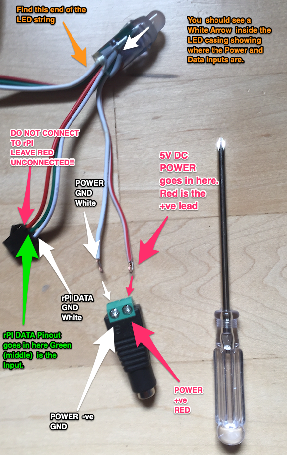
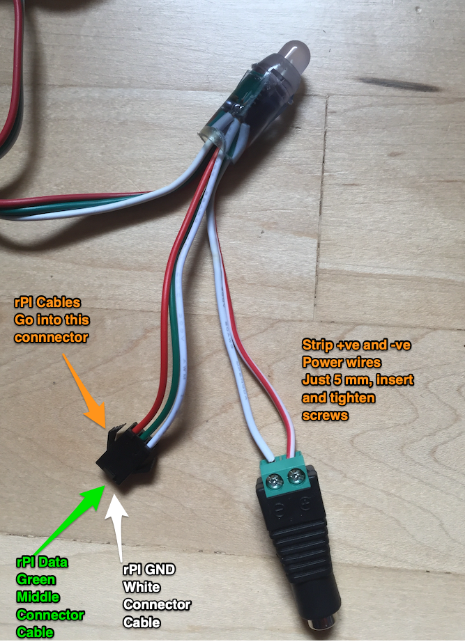
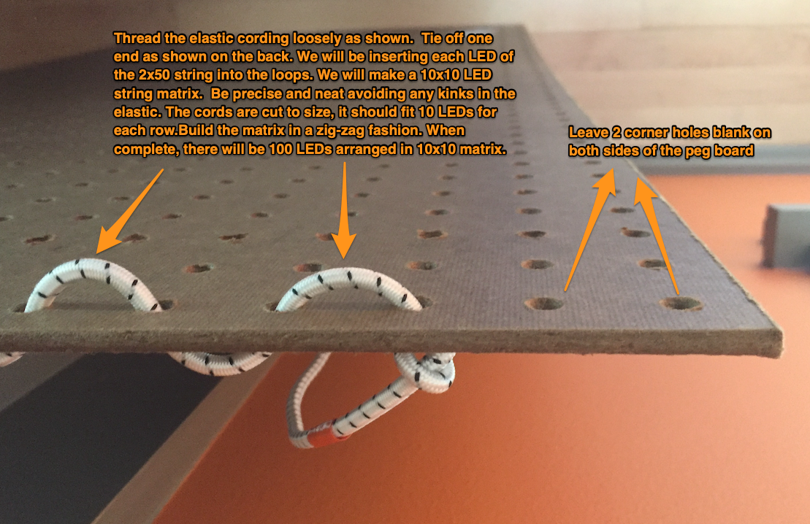
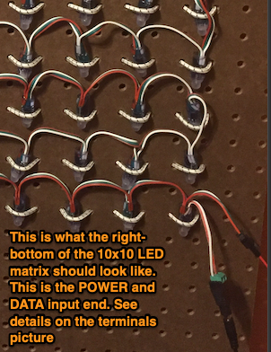
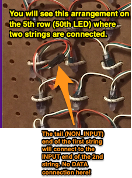
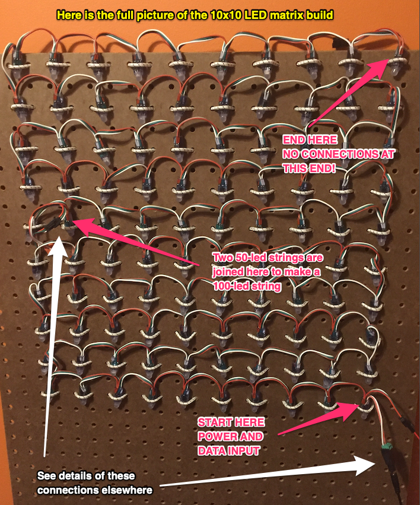

# Build and program rPI to light-up LED strings
LEDs are amazing inventions!  The have single-handedly reduced carbon emissions across our planet by significantly reducing the power needed to light our world inexpensively. LED's use 95% less energy and last 25 times longer.  Very few inventions have had such a sudden and real positive impact on societies around the world! 

To get to know how a LED works, [read this excellent article](https://electronics.howstuffworks.com/led.htm).

We will use a special kind of addressible LED's called neopixels. These come in a string or tape form.  We will be using strings of LED's with 50 or 100 bulbs in this project.

We will program a LED matrix to display an aryay of colors in any pattern we may desire to see with the power of Python.  At the end of this lab you can create whatever pattern you want to see with your choice of colors and literally see it come to light.  This is what Computing is all about, "make things happen in the real world", not just on your computer screen! 

### Step 1.  Build the Peg-board 100-LED string Matrix

Pictures are worth a thousand words, so I am not going to write a thousand words!!  The annotated pictures below will help us build the 100-LED matrix.  Please ask me for all the supplies.

***PLEASE DO NOT CONNECT TO POWER OR rPI UNTIL I HAVE VALIDATED YOUR BUILD!*** 













    🟠 ✅ Is your build validated ??

### Step 2.  Affix your rPI to the Peg board 

1. Go ahead and affix your rPI along with the ribbon-cable and breadboard setup to the pegboard using the elastic cording.  Ask me for details for on placement and method.

1. Also attach the Battery that will power your rPI to the pegboard. 

    🟠 ✅ Is your rPI and breadboard installed on the pegboard?

1. Power-up your rPI and access JupyterLab. DO NOT POWER THE LED MATRIX!

    🟠 ✅ Is your rPI responding?

### Step 3. Jupyter Notebook to test your LED Matrix

1. Download the ```neopixel_testing.ipynb``` by [right-clicking this link and select 'Save Link As'](neopixel_testing.ipynb).  Add this file to your folder in JupyterLab running on your rPI.  This starter notebook will be used as a base notebook for all your LED string projects.

1. Connect the +ve and GND Rail of your breadboard exactly matching what the code calls out for.  

1. Read through all of the code and try to guess what patterns it will make.  Note each line of code and understand what it will do.  Ask if you have any questions.

1. Take multiple pictures of your build and add these photos to ```neopixel_testing.ipynb``` notebook in the designated places.

    🟠 ✅ Is your rPI circuit validated?

    🟠 ✅ Did you add images to the ```neopixel_testing.ipynb``` notebook?

    🟠 ✅ Did you figure out the patterns that the LED matrix should show based on the code?

    🟠 ✅ Did you obtain a Power Supply from me for your LED matrix?

1. Now we will connect the Breadboard Rails and Power Supply to the LED matrix.  Make the DATA connections using the Male-Male cables. Make the power connections using the power supply barrel connector.

    🟠 ✅ Call me to VALIDATE YOUR CONNECTIONS !!!

1. Run the Jupyter Notebook ```neopixel_testing.ipynb``` ***CELL BY CELL** by hitting ```Shift-Enter```.  Wait at each cell for a few seconds to see if it executed properly.  

1. You might benefit from printing out multiple copies of [this table of pixel coordinates](pixel_coordinates.md) for designing your patterns.  Once you have designed your pattern, please upload that to the ```neopixel_testing.ipynb``` notebook.

1. Here is an [advanced example of neopixel animations](neopixel_advanced_testing.ipynb) that you can use to complete this project.

    🟠 ✅  Did you hand-draw your led patterns and upload to the ```neopixel_testing.ipynb``` notebook?.
    
    🟠 ✅  ***If you see errors STOP and debug***. Do not proceed without fixing them.

    🟠 ✅  Your job is to get the LED matrix to display the test patterns

1. Here is a different [a dynamic example of neopixel animations](nat.ipynb) that you can use to complete this project.

    🟠 ✅  Did you hand-draw your led patterns and upload to the ```neopixel_testing.ipynb``` notebook?.
    
    🟠 ✅  ***If you see errors STOP and debug***. Do not proceed without fixing them.

    🟠 ✅  Your job is to get the LED matrix to display the test patterns

    🟠 ✅  ***Congratulations!!  You finished this lab***