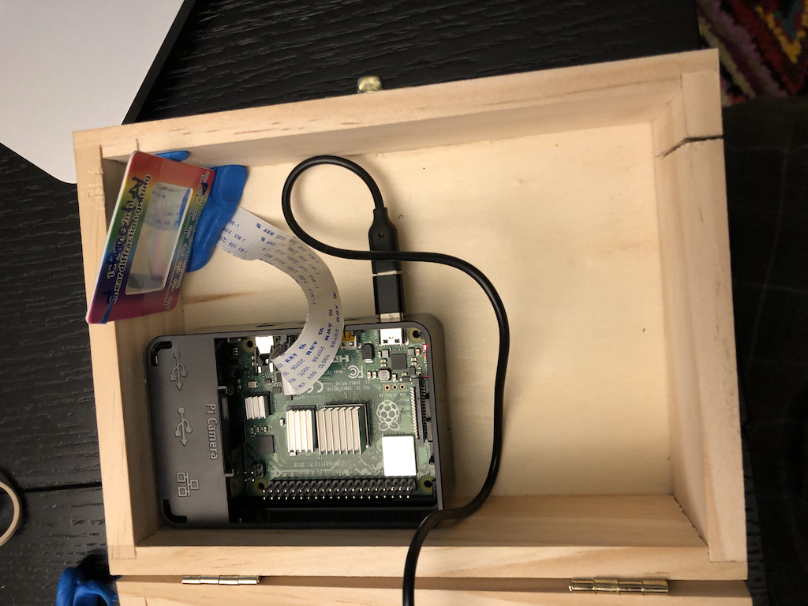
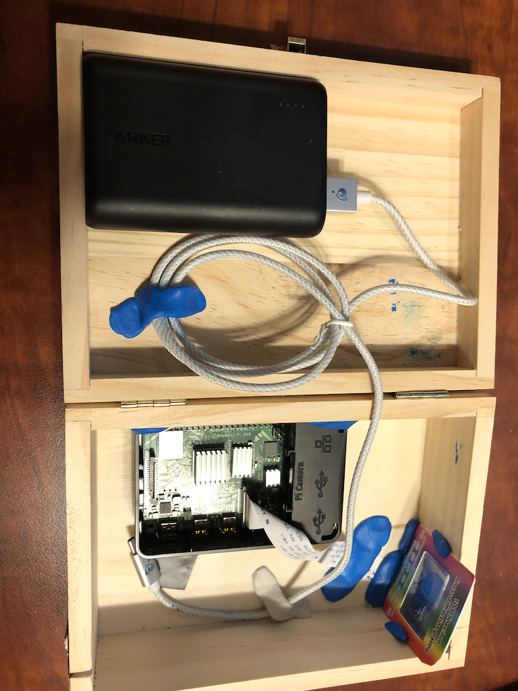
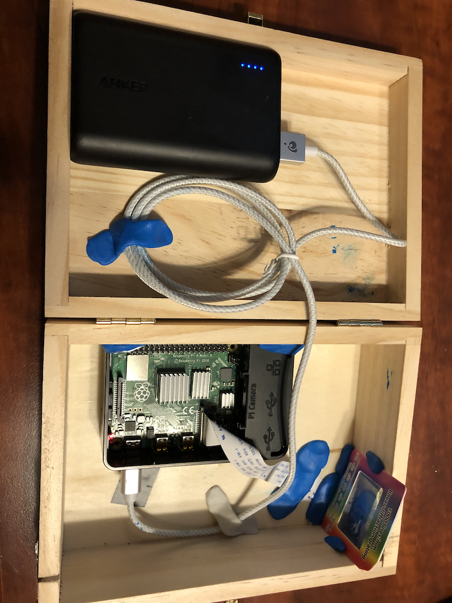
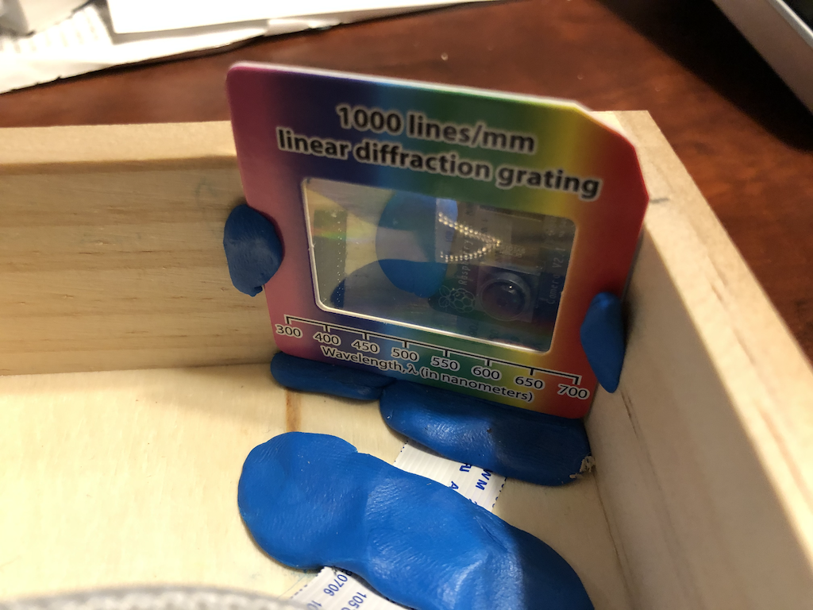
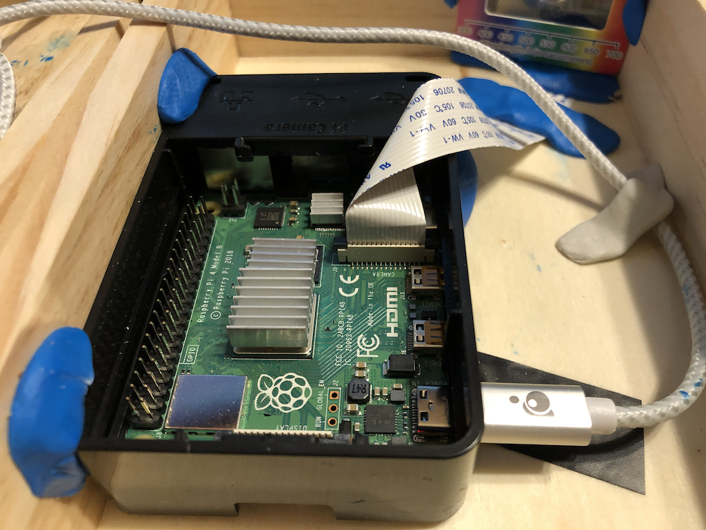
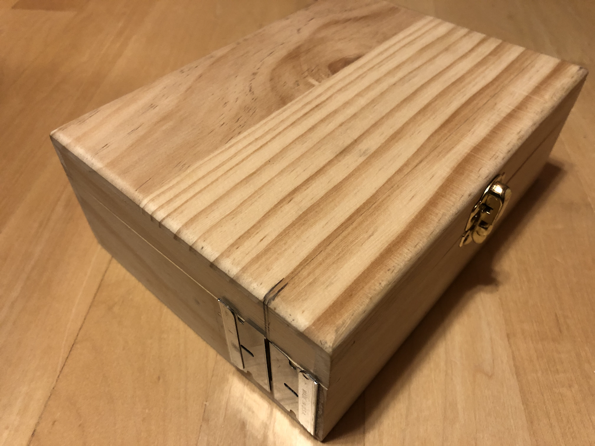

# Study Spectroscopy and Build a Raspberry PI Spectroscope
In this project we will start by studying the science of Spectroscopy and use your Computing skills to see it for yourself! To do this, we wiil build a Raspberry PI Spectroscope to measure emission spectra of the Sun and other elements! The build instructions are as follows. I will assign specific raspberry PI's for you to use during your build.

1. [Study the Science of Spectroscopy](The_Science_of_Spectroscopy_and_Computing.pdf)


1. [Use this document and following pictures](Final_Project_Bush_Digital_Spectroscope.pdf) as a guide for your build. Please use the play doh provided to complete your build.  Note the light path via the slit and the oruenation of the rPI and betteries with regard to the slit.







1. ```Right-Click on each item and save link as``` to download these 9 files to your Downloads folder on your own laptop.
     * [truetype font Lato](bds/V5/Lato-Regular.ttf)
     * [bdsproj notebook V5](bds/V5/bdsprojv5.ipynb)
     * [bdslib notebook V5](bds/V5/bdslibv5.ipynb)
     * [blue sky spectrum](bds/V5/blue_sky_spectrum.png)
     * [cloudy sky spectrum](bds/V5/cloudysky_wiki.png)
     * [cfls plot](bds/V5/cfls_plot.png)
     * [cfls specrum](bds/V5/cfls_spectrum.pdf)
     * [cfls standard](bds/V5/cfls_standard.png)
     * [cfls table](bds/V5/cfls_table.png)
     
1. Then ```Drag & Drop``` these 9 files from your laptop to your own student folder on your spectroscope's raspberry pi

1. Finally, we will ```Double Click``` on the ```bdsprojv5.ipynb``` to run the Jupyter notebook on the spectroscope you built. Please remember that only one person at a time can run their own version of the Jupyter Notebook.  Carefully read instructions before you run each cell of the notebook.  We will walkthrough this notebook in class before you attempt to do so!
